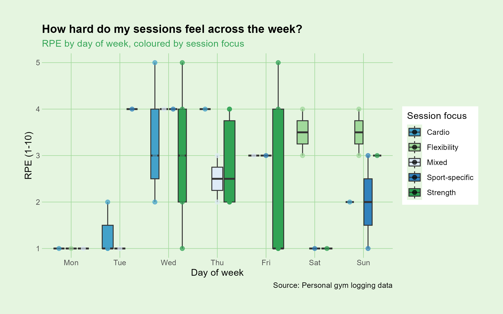
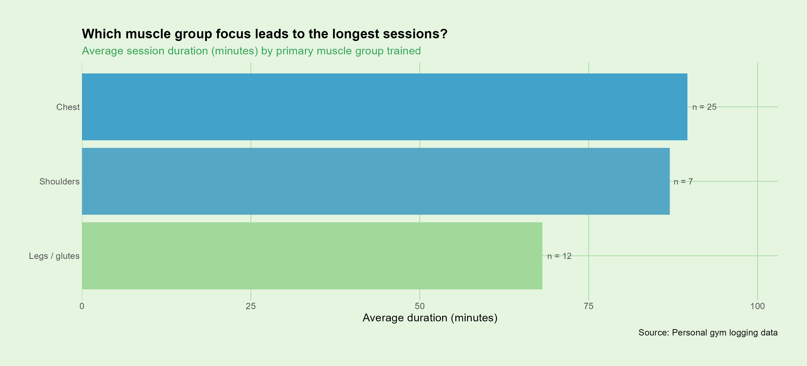
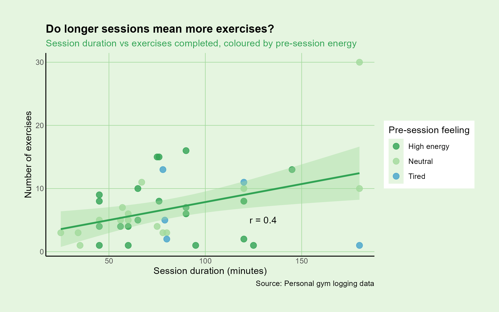

<script src="https://code.jquery.com/jquery-3.7.1.min.js" integrity="sha256-/JqT3SQfawRcv/BIHPThkBvs0OEvtFFmqPF/lYI/Cxo=" crossorigin="anonymous"></script>

```{r setup, include=FALSE}
knitr::opts_chunk$set(echo=FALSE, message=FALSE, warning=FALSE, error=FALSE, 
                      fig.width = 10, fig.height = 6, out.width = "100%")

```

```{js}
$(function() {
  $(".level2").css('visibility', 'hidden');
  $(".level2").first().css('visibility', 'visible');
  $(".container-fluid").height($(".container-fluid").height() + 300);
  $(window).on('scroll', function() {
    $('h2').each(function() {
      var h2Top = $(this).offset().top - $(window).scrollTop();
      var windowHeight = $(window).height();
      if (h2Top >= 0 && h2Top <= windowHeight / 2) {
        $(this).parent('div').css('visibility', 'visible');
      } else if (h2Top > windowHeight / 2) {
        $(this).parent('div').css('visibility', 'hidden');
      }
    });
  });
})
```

```{css, echo=FALSE}
body {
  font-family: Helvetica, sans-serif;
  background-color: #e5f5e0;
  color: #000000;
  margin: 0 auto;
  max-width: 900px;
  padding: 20px;
}

h1 {
  color: #31a354;
  text-align: center;
  font-size: 2em;
  letter-spacing: 1px;
  border-bottom: 3px solid #31a354;
  padding-bottom: 10px;
}

h2 {
  color: #ffffff;
  background-color: #31a354;
  text-align: center;
  padding: 12px 0;
  border-radius: 6px;
  letter-spacing: 1px;
}

p {
  font-size: 16px;
  line-height: 1.8;
  color: #000000;
}

.summary-box {
  background-color: #a1d99b;
  border-left: 6px solid #31a354;
  padding: 14px 24px;
  margin: 24px 0;
  border-radius: 6px;
  font-size: 16px;
  color: #000000;
}

.summary-box strong {
  color: #31a354;
}

.chart-caption {
  text-align: center;
  font-size: 13px;
  color: #3182bd;
  margin-top: -10px;
  margin-bottom: 20px;
  font-style: italic;
}

hr {
  border: none;
  border-top: 2px solid #a1d99b;
  margin: 30px 0;
}

img {
  display: block;
  margin: 0 auto;
  max-width: 100%;
  border: 2px solid #a1d99b;
  border-radius: 6px;
}
```

## A bit on how the data was collected

This data story is based on ***45 observations*** collected through personal gym session logging over the course of a month. Data gathered was from others in and around all university campuses in Auckland and I gave my personal response, as well as through social media, by asking participants to fill out a Google Form. Each response captured details about the session including the **primary workout focus, muscle groups trained, session duration, number of exercises completed, and how hard the session felt overall using a Rating of Perceived Exertion (RPE) scale**. Together, these variables allow us to explore ***patterns in workout preferences, training intensity, and session structure*** across different people and days of the week.

## Plot 1 — Boxplot showing RPE by day of week coloured by session focus



One of the first things I wanted to explore was whether ***my sessions felt harder*** on certain days of the week. The box plot shows various gym workout sessions recorded based on the **RPE scale** based on the day of the week from Monday to Sunday as the data was collected for over a month. **Wednesday** had a RPE range of 2-4 with a median of 3 RPE as the distribution of data points were **roughly symmetric** as the median was centered on the interquartile range. However, Monday showed a RPE of 1 as we cannot draw conclusions from them.

## Plot 2 — Bar chart showing average session duration by primary muscle group



By the average duration of the sessions across the primary muscle group trained, ***chest*** sessions had the highest average duration, based on 25 observations as the most reliable estimate among the three groups. While I tend to train **upper body** more frequently, chest sessions tend to run longer, possibly because I often train them on consecutive days.

## Plot 3 — Scatterplot showing session duration vs exercises completed coloured by pre-session energy



Finally, I explored on whether longer sessions naturally lead to more exercises being completed, and whether ***pre-session energy*** played a role. The regression line shows a **positive relationship** between session duration and number of exercises completed, with an R² of 0.4 as 40% of the **variability** in exercises completed is explained by session duration. However, the pre-session energy level does not appear to strongly separate the points with high energy and neutral sessions are **distributed fairly** evenly across the trend line, suggesting energy level may not be a **major driver** of exercise volume in this data set.


## So from what I can conclude is 

The three graphs present a ***coherent pattern***: session length is the greatest predictor of the total number of exercises completed; strength sessions have the **highest level of variability** in the amount of effort one associates with performing a fitness activity; and workouts for chest (even though they typically happen less frequently) tend to be the longest.

Therefore, the data suggest that how long you train has a ***stronger association*** with exercise volume than how energized you feel going in.
